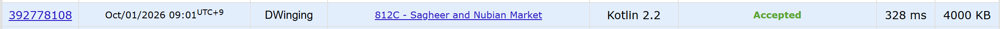

### Codeforces 1500 [Sagheer and Nubian Market](https://codeforces.com/problemset/problem/812/C) (Kotlin)

> **날짜:** 2026년 10월 01일  
> **문제 번호:** 812C  
> **알고리즘:** 이분 탐색, 정렬  
> **언어:** Kotlin  
> **핵심 키워드:** 파라매트릭 서치, 정렬

## 📌 문제 개요

- 서로 다른 `n`개의 기념품에는 각각 기본 가격 `a[i]`가 주어진다.
- `k`개를 구매할 때 인덱스가 `i`인 기념품의 가격은 `a[i] + i × k`가 된다.
- 각 기념품은 한 번만 구매할 수 있고, 총비용은 예산 `S`를 넘을 수 없다.
- 구매 가능한 기념품 수가 최대인 경우 중 최소 총비용을 구한다.

---

## 💡 풀이 핵심 (Core Logic)

### 1. 구매 개수를 기준으로 이분 탐색

구매할 기념품 수를 `0`부터 `n`까지 두고 이분 탐색한다. 어떤 개수 `k`를 예산 안에서 살 수 있다면 그보다 적은 개수도 살 수 있으므로, 구매 가능 여부가 단조성을 가져 파라매트릭 서치를 적용할 수 있다.

### 2. 후보 개수에 맞춘 실제 가격 계산과 정렬

`search` 함수는 후보 개수 `target`에 대해 각 기념품의 실제 가격을 `a[i] + (i + 1) × target`으로 다시 계산한다. 이후 가격 배열을 정렬해 가장 저렴한 `target`개를 선택함으로써, 해당 개수를 구매할 때 가능한 최소 총비용을 구한다.

### 3. 예산 판정과 최적 결과 갱신

정렬된 가격 중 앞의 `target`개를 더하면서 합이 예산을 넘으면 즉시 구매 불가능으로 판정한다. 구매 가능하면 개수와 최소 비용을 저장하고 더 큰 개수를 탐색하며, 불가능하면 탐색 범위를 줄인다. 탐색 종료 후 최대 구매 개수와 그 개수의 최소 총비용을 출력한다.

### 시간 복잡도

- `n`: 기념품의 수
- 이분 탐색의 각 단계에서 `n`개의 가격을 계산하고 정렬하므로 전체 시간 복잡도는 `O(n log² n)`이다.
- 후보 가격 배열을 별도로 생성하므로 공간 복잡도는 `O(n)`이다.

---

## 🧠 회고 및 결론

파라매트릭 서치를 연습하기 좋은 문제다.

---

### 📂 소스 코드

[Solution.kt](./Solution.kt)

---

### 🖥️ 실행 결과

---
