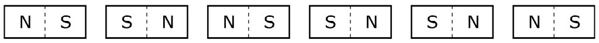
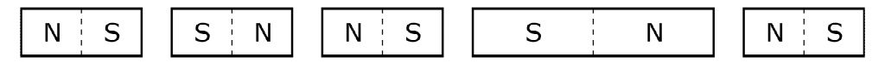

# [Unknown] 3144

## 📊 문제 정보
| 항목 | 내용 |
| :--- | :--- |
| 티어 | Unknown |
| 시간 제한 | 1 초 |
| 메모리 제한 | 128 MB |
| 알고리즘 | 등록된 분류가 없습니다. |
| 링크 | [백준 바로가기](https://www.acmicpc.net/problem/3144) |

---

## 📜 문제 설명

<p>동혁이는 자석을 매우 좋아하고, 자석을 이용해서 매우 독특한 실험을 한다. 동혁이가 가지고 있는 자석은 작은 막대처럼 생겼다. 자석은 길이가 1이고, 두 자극(S극과 N극)을 가지고 있다. 자석은 같은 극끼리는 붙지 않지만, 다른 극끼리는 서로 붙는다. 이 자석은 매우 강력한 자석이기 때문에, 한 번 붙으면 다시 뗄 수 없다.</p>

<p>실험을 시작하기 전에 동혁이는 N개의 자석을 바닥에 놓는다. 그 다음 실험을 시작하면 다른 극을 마주 보고 있는 자석은 모두 붙는다. 자석은 실험을 시작하기 전에는 붙지 않는다. 또, 실험을 시작한 후, 붙은 자석은 뗄 수 없다.</p>

<p>예를 들어, 동혁이가 실험을 시작하기 전에 자석 6개를 다음과 같이 놓았다고 생각해보자.</p>

<p style="text-align: center;"></p>

<p>동혁이가 실험을 시작하면, 자석은 다음과 같이 붙게된다.</p>

<p style="text-align: center;"></p>

<p>사실 동혁이는 길이가 정확히 L인 자석이 필요해서 이 실험을 시작하게 된 것이다. 동혁이가 자석을 놓은 초기 배치가 주어졌을 때, 몇 개의 자석을 뒤집으면 길이가 정확히 L인 자석을 얻을 수 있는지 구하는 프로그램을 작성하시오. 만약, 여러 가지 경우가 있다면 뒤집는 횟수가 가장 작은 것을 출력한다.</p>

### 📥 입력

<p>첫째 줄에 자석의 수 N과 동혁이가 만들려고 하는 자석의 길이 L이 주어진다. (1 ≤ N ≤ 500000, 1 ≤ L ≤ N)</p>

<p>다음 줄에는 초기 자석의 배치를 나타내는 문자열 "NS" 또는 "SN"이 N개가 주어진다.</p>

<p>항상 답이 존재하는 경우만 주어진다.</p>

### 📤 출력

<p>길이가 정확히 L인 자석을 만들기 위해서 필요한 뒤집는 횟수의 최솟값을 출력한다.</p>

---

## 💡 예제

### 예제 1
**Input:**
```text
6 4
NS SN NS SN SN NS
```
**Output:**
```text
1
```

### 예제 2
**Input:**
```text
4 4
NS SN NS SN
```
**Output:**
```text
2
```

### 예제 3
**Input:**
```text
15 13
SN NS NS SN NS SN SN NS NS SN SN NS NS NS SN
```
**Output:**
```text
3
```

---

## 📜 나의 제출 기록

| 제출 번호 | 결과 | 메모리 | 시간 | 언어 | 제출 일자 |
| :--- | :--- | :--- | :--- | :--- | :--- |
| 102188668 | ✅ 맞았습니다!! | 51196 KB | 272 ms | Java 8 / 수정 | 2026년 1월 22일 |
| 102183159 | ❌ 틀렸습니다 | - KB | - ms | Java 8 / 수정 | 2026년 1월 22일 |

---

## 🖼️ 이미지





