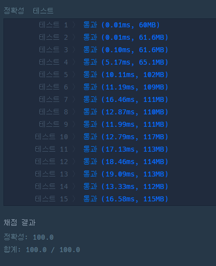

### 프로그래머스 [풍선 터트리기](https://school.programmers.co.kr/learn/courses/30/lessons/68646) (Java)

> **날짜:** 2026년 5월 12일  
> **알고리즘:** Stack, 자료구조 
> **언어:**  Java  
> **핵심 키워드:**  Stack, Sorting, PriorityQueue, Lazy-delete

## 📌 문제 개요

인접한 두 풍선을 고른 뒤, 둘 중 하나를 터트리는 과정을 풍선 1개가 남을 때 까지 반복합니다.
기본적 항상 번호가 더 큰 풍선을 터트리지만, 전체 과정 중 최대 1번에 한하여 번호가 더 작은 풍선을 터트릴 수 있는 찬스가 주어집니다. 어떤 풍선이 최후까지 남을 수 있는지 판별하여, 최후까지 남길 수 있는 풍선의 총 개수를 반환하는 문제입니다.

---

## 💡 풀이 핵심 (Core Logic)

* 임의의 풍선 a[i]가 최후까지 살아남으려면, a[i]를 기준으로 왼쪽 구간의 최솟값과 오른쪽 구간의 최솟값 중 적어도 한 곳의 최솟값보다는 a[i]가 작아야 합니다.
* 만약 양쪽 구간의 최솟값이 모두 a[i]보다 작다면, 작은 풍선을 터트리는 찬스를 1번 사용하더라도 살아남을 수 없습니다.

---

## 📊 풀이 방식 비교 ( vs )

| 비교 항목 | 정렬 (Sorting) + Lazy | Priority Queue + Lazy | Stack (정적 배열 활용) |
| --- | --- | --- | --- |
| **시간 복잡도** | $O(N \log N)$ | $O(N \log N)$ | **$O(N)$** |
| **공간 복잡도** | $O(N)$ | $O(N)$ | $O(N)$ |
| **전처리 비용** | 매우 높음 (전체 정렬) | 높음 (100만 회 삽입/삭제) | **낮음 (단일 순회)** |
| **메모리 효율** | 보통 | 낮음 (객체 오버헤드 발생) | **높음 (연속 메모리)** |
| **조건 분기** | 복잡 (Lazy 체크) | 복잡 (값 유효성 검사) | **단순 (top 비교)** |
| **실행 속도** | 상대적으로 느림 | 보통 | 빠름 |

---

## 🛠 성능 최적화 인사이트 (Performance Insights)

1. 정렬 + Lazy Delete
* **시간 복잡도 :** $O(NlogN)$ (전체 배열 정렬 비용)
* **오버헤드:** 조건을 만족하지 않는 풍선을 건너뛰기 위해 Lazy Delete 방식을 적용할 경우, 반복적인 if 조건 분기나 별도의 상태 추적 로직이 필요합니다.

2. PriorityQueue(우선 순위 큐)
* **시간 복잡도 :** $O(NlogN)$에 수렴함
* **정렬과 비교:** 필요한 최솟값만 사용할 수 있기 때문에 전체 배열 정렬 방식 보다는 논리적으로 유리하다.
* **지양한 이유:** 최악의 경우 정렬 방식과 차이가 없으며, Lazy Delete 방식을 사용해야합니다.

3. Stack(정적 배열 제어)
* **시간 복잡도:** $O(N)$ (배열을 한 번 순회하며 전처리)
* **오버헤드(최적화):** int[] 정적배열과 top 포인터만 사용하여 메모리를 제어하며, 현재 값과 `stack[top]` 단 1번의 비교 연산만으로 로직이 수행하여 오버헤드가 줄어듭니다.

---

## 🧠 회고 및 결론

코드는 비교적 간단하지만, 발상이 까다로워 Lv3이 된 문제 같다. 처음에는 정렬 후 lazy delete 처리를 할까 생각을 해봤다. 하지만 배열의 최대 길이가 1,000,000으로 큰 편이고, stack을 활용하면 굳이 정렬까지 할 필요는 없을 것 같다고 판단했다.

---

### 📂 소스 코드
*   [Detailed Review (Velog)](https://velog.io/@dong20/Java-프로그래머스-풍선-터트리기)
*   [정답 코드 - Stack 풀이](./ac_code.java)
 
---

### 🖥️ 실행 결과

---