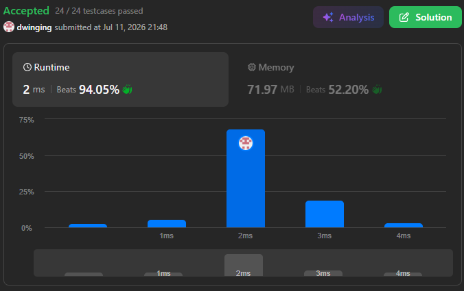

### LeetCode 238 [Product of Array Except Self](https://leetcode.com/problems/product-of-array-except-self/description/) (Java)

> **날짜:** 2026년 07월 11일  
> **알고리즘:** 누적 합, 그리디  
> **언어:**  Java  
> **핵심 키워드:** 누적 곱

## 📌 문제 개요

* **문제명:** Product of Array Except Self
* **설명:** 정수 배열 `nums`가 주어질 때, `answer[i]`가 `nums[i]`를 제외한 나머지 모든 요소의 곱이 되도록 하는 배열 `answer`를 반환해야 한다.
* **제약 조건:**
  * 나눗셈 연산(`division`) 사용 금지.
  * $O(n)$ 시간 복잡도 필수.
  * 추가 공간 복잡도 $O(1)$ 권장 (결과 배열 제외).

---

## 💡 풀이 핵심 (Core Logic)

### 1. 양방향 누적 곱(Prefix & Suffix Product) 전략

* 나눗셈을 사용할 수 없으므로, 각 위치 $i$를 기준으로 왼쪽의 모든 곱(Prefix)과 오른쪽의 모든 곱(Suffix)을 구하여 두 값을 곱하는 방식을 취한다.
* 이를 위해 별도의 보조 배열을 사용하는 대신, 결과 배열 `answer`를 직접 활용하여 공간 효율성을 극대화한다.

### 2. 공간 최적화 프로세스

* **1차 순회 (Prefix):** `answer[i]`에 `nums[0]`부터 `nums[i-1]`까지의 누적 곱을 저장한다.
  *  `answer[0]`은 자기 자신의 왼쪽에 값이 없으므로 `1`로 초기화한다.
* **2차 순회 (Suffix):** 배열을 뒤에서부터 순회하며, 누적된 오른쪽 곱(`right`) 값을 기존 `answer[i]`에 곱해나간다.
  * 이 과정에서 `right` 변수를 사용하여 별도의 배열 할당 없이 현재 위치의 오른쪽 곱들을 실시간으로 반영한다.

---

## 🧠 회고 및 결론

흥미로운 문제였다. 처음 문제를 읽을 때 나눗셈을 사용하지 말라는 제약 조건을 놓쳤고, 누적 곱을 구한 뒤 나눗셈 연산을 활용하고자 하였다. 이 때 문제가 되는 부분이 배열에 0이 포함된 경우 였다. 값을 0으로 나눌수는 없기 때문에 예외 처리가 필요하다.

나눗셈을 활용한 풀이를 구현할 경우 3가지 경우로 나누어진다.

1. 0이 1개인 경우 => 해당 값을 제외한 나머지 값이 모두 0이다.
2. 0이 여러개인 경우 => 모든 결과 값이 0이된다.
3. 0이 없는 경우 => 기존에 구상한 풀이를 구현하면 된다.

그래서 0을 카운트 하는 방식으로 스택을 활용할지, 카운팅을 할지 고민하면서 문제를 한국어로 번역헀다.

한국어로 문제를 번역 후 확인했을때 나눗셈을 사용하지 말라는 제약조건을 확인하게 되었다. 조건 확인 후에는 양방향 누적 곱 전략을 활용해 문제를 해결했다.

---

### 📂 소스 코드
*   [Solution.java](./Solution.java)
 
---

### 🖥️ 실행 결과

---